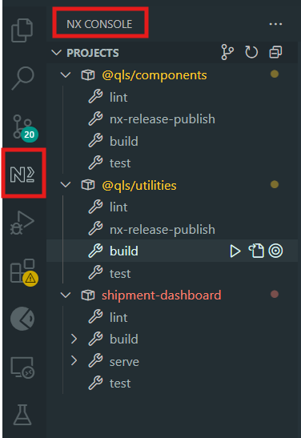

# Shipment dashboard

### Known issues

1. If you want to create a new shipment, don't fill in any fields and tries to save the shipment, you'll see that the required input fields turn red. However, no validation message is shown. This is a known issue which has to do with the transloco package. The issue can be found [here](https://github.com/ngneat/error-tailor/issues/64). Unfortunately, I came across this issue when I was almost done with the assessment. In order to see the validation message for a form field, you'll have to enter a value in the form field.

2. If you have any issues when running/building the project, please delete the `.nx` and `.angular` folders. These folders contain cached data and sometimes it can cause some issues

# Commands

This is an overview of the available commands for this project.

| shipment-dashboard                    | @qls/components                   | @qls/utilities                    |
| ------------------------------------- | --------------------------------- | --------------------------------- |
| `npx nx run shipment-dashboard:serve` | `npx nx run @qls/utilities:build` | `npx nx run @qls/utilities:build` |
| `npx nx run shipment-dashboard:build` | `npx nx run @qls/components:test` | `npx nx run @qls/utilities:test`  |
| `npx nx run shipment-dashboard:test`  |                                   |                                   |

The commands for the `shipment-dashboard` default to the `development` configurations. I you want to use the `production` configuration, you'll need to add `:production` at the end of each command. So: `npx nx run shipment-dashboard:build` becomes `npx nx run shipment-dashboard:build:production`.

If you're using VSCode, you can also install the `NX Console` extension. It'll looks like this: 

# Project

This project was build with the idea of modularity. Let's start with the libraries.

## Libraries

There are 2 libraries: the component and utility libraries. The idea behind these libraries is that ideally these are hosted as `npm` packages which can be installed in any app and you'll be able to import things like the tailwind config. To replicate this idea, without using `npm link` to create a symlink, you'll see that both the component library and the shipment-dashboard app have the same tailwind configuration.

I also use secondary imports in the libraries. The reason I do this is to create a cleaner/smaller build output. Normally you'll have a barrel file (an index.ts) file where all your exports are listed. This'll mean that if your component (let's say it's named AppWrapperComponent) uses 1 or 2 items from the library, when you're app is build and webpack comes across the AppWrapperComponent, everything from the barrel file is added to the bundle of the AppWrapperComponent. To prevent this, I use secondary imports. If I use a utility like `@Memoize`, it's not imported from `@qls/utilities` but from `@qls/utilities/reactive` and this means that only the files that have something to do with the utility is added to the bundle.

## Apps

This is the actual app for the shipment dashboard. In the app I use mapper functions. These functions add stability to the frontend. Let's say a property name is changed in the backend. To fix this in the frontend when you don't use mappers, you'll have to not only change the interface, but also all the places where said interface is used. The bigger the app and the more the interface is used, the more places you'll have to fix this. Mapper functions solve this. Before posting and after getting the data from the backend, you can use a mapper function that maps the data to that that matches an interface. Now, if a property in the backend changes, you'll only have to change this in the corresponding mapper function and interface.
